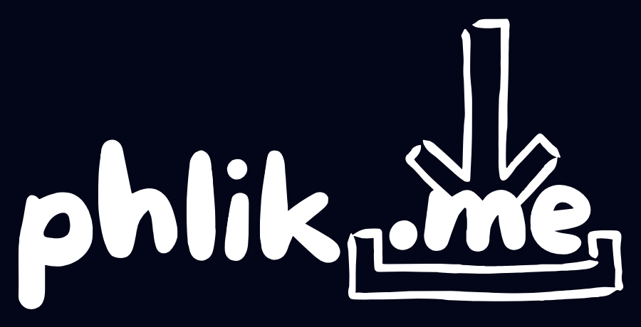

  
  <h1>Technical Documentation</h1>

## Description

Phlick.me is a browser based P2P file sharing client utilising webRTC. It is intended to be a simple universal method to share files of any size across any kind of device. A typical use case would be sending photos from your phone to your PC, regardless of what OS the PC is running or what make of phone it is.

## Design Principles

- **Anonymity** — No accounts, no information stored.
- **Simplicity** — UI is minimal and UX is to the point.
- **Security** — Files are encrypted and sent directly to the recipient device.

## System Overview

### Client Manager (Server)

The client manager generates and stores a map of private to public IDs. The private ID is stored locally on the client after generation and is used to authenticate a client to its corresponding public ID.

### Pub/Sub

Facilitates real time communication between clients and signalling for webRTC. Clients can only listen on their granted public ID channel but can publish to any other client's public ID channel they know about.

### Local Client (App)

Local clients run on the browser and act as both client and server, communicating via pub/sub and webRTC. All information about the client and clients it knows about are stored locally and strictly exchanged client to client. After signalling, file data is exchanged through webRTC.

## Tech Stack

- **Frontend:** Typescript + Svelte
- **API/Server:** Typescript + SvelteKit
- **Database:** Redis
- **Pub/Sub:** Ably
- **Build Tool:** Vite
- **Testing:** Vitest + Playwright
- **Code Quality:** ESLint + Prettier
